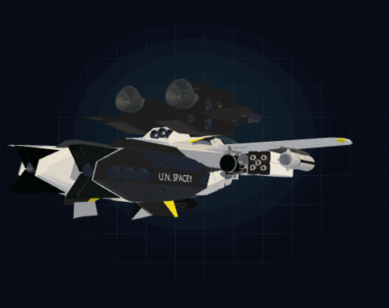

<div align="center">

# 🛸 Macross — VF-1 瓦尔基里桌面机体

### 你的 Claude Code 僚机:一架会变形的 3D **VF-1S 瓦尔基里**,在你的 macOS 桌面边沿巡航——当 AI 智能体等你授权时拉响警报,任务完成时报告"已着陆"。

[](https://github.com/One-DayWorld/DesktopPet)
[](https://www.electronjs.org/)
[](https://threejs.org/)
[](https://claude.com/claude-code)
[](https://github.com/One-DayWorld/DesktopPet/stargazers)

[English](./README.md) · **简体中文**



</div>

---

## ✨ 它能做什么

- 🤖 **智能体雷达** —— VF-1 同时盯着 **Claude Code** 和 **OpenCode** 会话。智能体卡在授权确认、或跑完一轮等你回复时,机体闪金光、目标锁定 HUD 脉冲、语音呼叫。再也不用守着另一个窗口里的终端。
- 🛸 **真正会变形的机体,不是贴图** —— Three.js 实时渲染的完整 **Fighter ↔ Gerwalk ↔ Battloid** 三形态变形。它沿屏幕边沿巡航、入弯压坡度、横滚、悬停喷焰。
- 🎛️ **是座舱,不是气泡提示** —— 单击机体,滑出 HUD 风格控制面板:大模型对话、实时终端会话监控、可复用的 AI 工作流。
- 🧠 **它会越来越懂你** —— 聊得越多(以及你投喂的文章越多),它越了解你的兴趣、性格和你舒服的语气。记忆**跨重启持久保存**、完全本地,你随时可查看/编辑/清空。**羁绊值**取代了战斗经验——等级越高,越懂你。
- 🧠 **自带大脑** —— 机体只是躯壳,智能来自你接入的 **千问 / DeepSeek**,还可选联网搜索。
- 🔒 **完全本地** —— 无遥测、无云同步。密钥、状态、以及它记住的关于你的一切,都存在家目录下权限 `0600` 的文件里。

> 机体本身不是 AI,它是一个**前端容器**。智能来自你在 `CONFIG` 里绑定的大模型。

---

## 🚀 快速开始

### 方式 A —— 安装预编译 DMG(普通用户)

1. 从 [Releases](https://github.com/One-DayWorld/DesktopPet/releases) 下载 `Macross-1.0.0-arm64.dmg`(Apple Silicon)。
2. 拖进 `应用程序`。
3. 首次启动未签名,会被 Gatekeeper 拦截。**右键 → 打开 → 确认**,或执行:
   ```bash
   xattr -dr com.apple.quarantine /Applications/Macross.app
   ```
4. 到 **系统设置 → 隐私与安全性 → 辅助功能** 给 Macross 授权(读取终端内容需要)。
5. 打开 `CONFIG` 面板,至少填一个大模型 API Key。

### 方式 B —— 源码运行(开发者)

需要 **Node.js 18+**;Apple Silicon 还需 `xcode-select --install`。

```bash
git clone https://github.com/One-DayWorld/DesktopPet.git
cd DesktopPet
npm install          # 约 300 MB, 主要是 Electron + Three.js
npm start
```

<details>
<summary>报 <code>Electron failed to install correctly</code>?(国内网络常见)</summary>

```bash
export ELECTRON_MIRROR=https://npmmirror.com/mirrors/electron/
rm -rf node_modules/electron
npm install electron --save-dev
npm start
```
</details>

---

## 🤖 核心卖点:Claude Code 联动

VF-1 用视觉 + 语音把 Claude Code 会话里发生的事"砸"到你眼前,让你放手跑智能体而不必盯着终端。

```
Claude Code 请求授权
        ↓
~/.claude/settings.json 的 hook 触发  vf1-notify.sh
        ↓
vf1-notify.sh 写入 flag 文件(含 tty 路径)
        ↓
Macross 的 flag 监视器触发 → 金色眼睛 + 目标锁定 HUD + 循环语音
        ↓
你单击 VF-1 → 它把对应的终端窗口切到最前
        ↓
Claude 完成 → Stop hook 触发 → VF-1 播报"任务已完成"
```

**零手动配置。** 每次启动,Macross 幂等地把 hook 脚本装到 `~/.macross/`,并把 `PermissionRequest` / `PostToolUse` / `PermissionDenied` / `Stop` 四个 hook 写进 `~/.claude/settings.json`。内部工具(`TaskCreate`、`LSP` 等)和 `bypassPermissions` 模式已加白名单,只在真正需要时才告警。

**终端支持:** Terminal.app 与 iTerm2(完整支持);WezTerm / Warp / Alacritty / Hyper 回退到激活 Terminal.app。

**也监控 OpenCode:** Macross 轮询 OpenCode 的本地会话数据库(`~/.local/share/opencode/opencode.db`)。当某一轮结束(`step-finish` / `stop`)且在等你回复时,触发同样的视觉和语音告警。由于 OpenCode 的数据库里区分不出"等授权"还是"任务完成",它只显示单一的"等待回复"状态;而 Claude Code 靠 hook 能通过不同的视觉状态和语音播报区分**授权等待**和**任务完成**两种场景。

---

## 🛸 机体行为

<details open>
<summary><b>边沿巡航</b>(默认开启)</summary>

待机时,VF-1 沿屏幕四角巡航:
- **横边** → 变 **Fighter**,机头锁定航向,机翼随气流轻摆。
- **竖边** → 变 **Gerwalk**,面向你、靠蓝白脚部喷口悬停。
- **随机机动**(约每 22 秒):横滚、压翼致敬、摆尾、推力上跳、左右扫视、横向位移。
- 你一拖动 / 一有告警就立刻让位,之后从中断处续飞。
</details>

<details>
<summary><b>反应状态</b></summary>

| 触发 | 行为 |
|---|---|
| Claude Code 授权确认 | 眼睛闪金光、目标锁定 HUD、每 30 秒语音 |
| Claude Code 任务完成 | 语音播报 + 常驻气泡直到单击 |
| OpenCode 一轮结束 | 语音播报 |
| 任务完成态下单击 | 把对应终端窗口切到最前 |
| 休息提醒定时 | 飞到屏幕中央播报,再飞回原位 |
| 合盖 / 系统休眠 | 定时器暂停;唤醒后计数器重置,避免补发一堆提醒 |
</details>

单击只在机体上生效,透明区域的点击会穿透到后面的窗口。

---

## 🎛️ 座舱面板

单击 VF-1 打开 HUD 风格的 3 标签控制面板:

| 标签 | 用途 |
|---|---|
| **CHAT** | 大模型对话 + 快捷动作(天气/日历/新闻/赛事)+ 一键启动器 + 📎 投喂文章(txt / docx / 链接) |
| **WORKFLOW** | 保存并一键运行可复用 AI 提示词 |
| **CONFIG** | 机体名/头像、休息提醒、边沿巡航开关 + 复位、大模型后台、API Key、Obsidian 双向关联、打开设定文件(编辑性格/规则/记忆)、从头开始(清空记忆与羁绊) |

---

## 🧠 长期记忆 —— 它会慢慢懂你

VF-1 不是金鱼。它会为你建立一份**跨重启持久保存的画像**,并逐渐把闲聊语气调成你舒服的样子。

```
你聊天 / 投喂一篇文章
        ↓
会话边界(收起 panel)或每 ~10 轮
        ↓
后台 LLM 把「旧画像 + 新对话」提炼出新画像
        ↓
profile.json 更新 · 羁绊值增长
        ↓
下次聊天:精炼后的画像(几百 token)注入 system prompt
```

**三层记忆**,全部在 `~/.desktop-pet/memory/`:
- **画像 profile** —— 结构化理解:`facts`(事实)、`interests`(兴趣)、`commStyle`(沟通偏好)、`toneContract`(和你说话的规则)。每次聊天注入的就是它。
- **文章 articles** —— 用 📎 按钮投喂 `.txt` / `.docx` / 链接(或直接粘一个纯 URL),归档原文并从中提炼你的兴趣。
- **对话归档 chat-archive** —— 每轮完整记录(按月 `.jsonl`),供回溯重炼。

**羁绊值取代战斗经验。** 它**只靠交流增长** —— 聊天(+8)、投喂文章(+25)、模型提炼出新理解(+15)。等级门控**画像注入的深度**:

| 羁绊等级 | VF-1 的表现 | 注入的画像深度 |
|---|---|---|
| Lv 1–2(初识) | 默认语气,谨慎,少做假设 | 仅已知事实 |
| Lv 3–5(熟识) | 开始贴合你的语气(详略 / 温度 / emoji) | + 兴趣 & 沟通偏好 |
| Lv 6+(默契) | 用你喜欢的方式说话,主动引用你关注的事 | + 完整语气契约 |

**两种语气,互不干扰。** 告警和任务完成播报永远是固定预写台词、诙谐幽默口吻(走 `voice-lines.json`,不经 LLM —— 所以记忆绝不会污染它们)。只有 **CHAT** 标签会贴合你。而且你始终掌控:**CONFIG** 标签提供打开设定文件按钮(直接编辑性格/规则/记忆三合一的文本文件)和从头开始按钮(清空近期对话、长期记忆、羁绊等级,保留你设定的性格与原始备份)。一切都不离开你的电脑。

---

## 🗂️ Obsidian 双向关联

VF-1 可以和本地 Obsidian Vault 做 local-first 双向关联:一边读取你的知识库来完善人物画像,一边把聊天里值得沉淀的内容写回知识库。

默认配置:

| 项目 | 默认值 |
|---|---|
| Vault 路径 | `/Users/ace/Documents/OneDayWorld` |
| 可读范围 | Vault 下所有 `.md` 文件,包含子目录 |
| 自动排除 | `.obsidian/`、隐藏路径、写回目录 |
| 写回目录 | `/Users/ace/Documents/OneDayWorld/Macross` |

写回文件:

| 文件 | 内容 |
|---|---|
| `Macross/Profile.md` | VF-1 当前理解到的长期画像 |
| `Macross/Inbox.md` | 聊天里可沉淀但尚未归类的条目 |
| `Macross/Chat Highlights/YYYY-MM.md` | 按月份归档的高价值聊天摘要、结论和后续行动 |

`CONFIG → OBSIDIAN · 知识库` 里有三个开关:

| 开关 | 作用 |
|---|---|
| **启用 Obsidian 双向关联** | 总开关。关闭时不读、不写;即使后两个开关打开也不会生效。 |
| **自动同步笔记到画像** | 开启后定期扫描 Vault 中新增/变更的 Markdown,分批提炼进长期画像。也可以点「立即同步」手动触发。 |
| **自动写回知识库** | 开启后,聊天达到阈值、关闭 panel、或退出 app 前,会尝试把 Profile / Inbox / Highlights 写回 `Macross/`。 |

因此:如果第一个关闭,第二和第三个打开,**不会写回**。必须先打开总开关,自动同步和自动写回才会实际运行。

实现上保留了 adapter 层,当前版本直接读写本地 Vault;后续如果改成 Obsidian Local REST API,只需要替换 adapter,主流程和 CONFIG UI 不需要重做。

---

## 🧠 大模型后台

两种后台,统一走 OpenAI 兼容接口,在 `CONFIG → AI 后台` 配置:

| 后台 | 默认模型 | 端点 | 获取 Key |
|---|---|---|---|
| **千问** | `qwen-plus` | DashScope(阿里云) | [dashscope.console.aliyun.com](https://dashscope.console.aliyun.com) |
| **DeepSeek** | `deepseek-chat` | api.deepseek.com | [platform.deepseek.com](https://platform.deepseek.com) |

> 可选:在 `CONFIG → 网页搜索` 填 [Metaso](https://metaso.cn) Key,让 AI 能联网查赛果、新闻、股价。

---

## 🏗️ 架构

Electron 主进程(`main.js`)驱动两个 `BrowserWindow` —— 透明的**机体窗口**(Three.js)和**座舱面板**,通过收紧权限的 `contextBridge`(`preload.js`)与渲染层通信。

```
main.js ── IPC ──┬── pet.html      (Three.js VF-1: GLB 加载、变形、巡航、机动)
   │             └── panel.html    (HUD 3 标签 UI: 对话、工作流、配置)
   ├── 大模型客户端(千问 / DeepSeek)
   ├── memory.js —— 长期画像存储 + 提炼引擎 + 文章/对话归档
   ├── 边沿巡航循环 + 休息提醒
   ├── Claude Code flag 文件监视 + hook 自动安装
   ├── OpenCode 会话数据库轮询(SQLite, step-finish 检测)
   └── AppleScript/JXA 桥(终端聚焦与输入、应用启动器)
```

技术看点:透明窗口 + 命中区鼠标穿透;单条 GLB 动画轨道按时间手动驱动完成三形态变形;SpeechSynthesis 用 `cancel()+resume()` 绕过 Chromium 长时空闲后静音的 bug。

---

## 🛠️ 打包 DMG

```bash
npm run build -- --mac --arm64   # Apple Silicon
npm run build -- --mac --x64     # Intel
npm run build                    # 两者
```

产物:`dist/Macross-1.0.0-<arch>.dmg`(ad-hoc 签名,首次启动有 Gatekeeper 提示)。有 Apple 开发者 ID 的话,在 `package.json` 的 `build.mac` 加 `identity`、去掉 `gatekeeperAssess: false`。

---

## 📦 数据与隐私

全部本地 —— 无遥测、无云同步。

| 数据 | 位置 |
|---|---|
| 机体状态、对话历史、API Key、设置 | `~/.desktop-pet/data.json`(`0600`) |
| 长期记忆:画像、投喂的文章、对话归档 | `~/.desktop-pet/memory/`(目录 `0700`,文件 `0600`) |
| Obsidian 同步状态 | `~/.desktop-pet/obsidian-sync.json`(`0600`) |
| Obsidian 写回内容 | Vault 内的 `Macross/` 目录 |
| Claude Code / OpenCode hook 脚本 + flag | `~/.macross/`(`0700`) |
| Claude Code hook 配置 | `~/.claude/settings.json`(幂等自动注入) |

以上全部存在家目录 —— **均不在仓库内**,且 `.gitignore` 额外拦截 `.desktop-pet/`、`.macross/`、`data.json`、`profile.json` 作为第二层防线。记忆面板(CONFIG)可两步点击清空 VF-1 对你的全部记忆。

---

## 📜 许可证与素材

**应用代码**以 [MIT 许可证](./LICENSE) 发布。<!-- ⚠️ 记得加 LICENSE 文件 -->

内置 3D 模型为 *Macross / Robotech*、*高达* 系列的**第三方同人素材**,仅供个人/学习使用,**不在本仓库许可证覆盖范围内**;如需再分发请先确认原作者条款。*Macross* 是 Big West / 龙之子的商标。

---

<div align="center">

如果它让你会心一笑,**点个 ⭐ 吧 —— 能帮更多飞行员找到自己的僚机。**

**Roy Focker,呼号 Skull One。待命中。** 🦅

</div>
